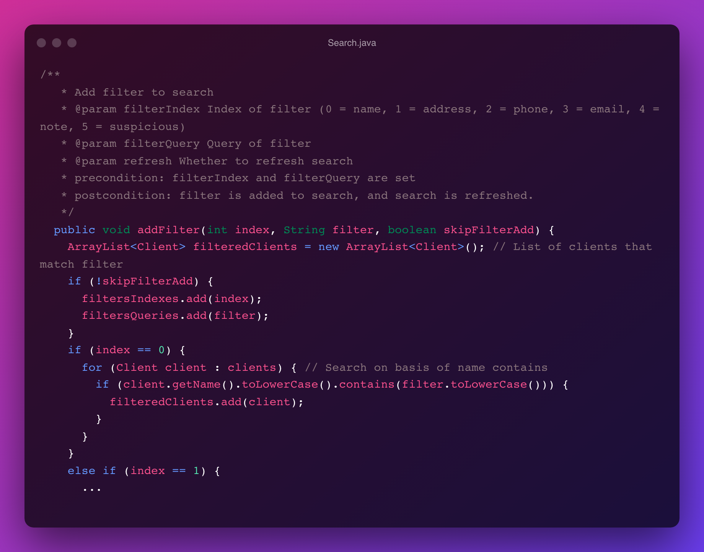
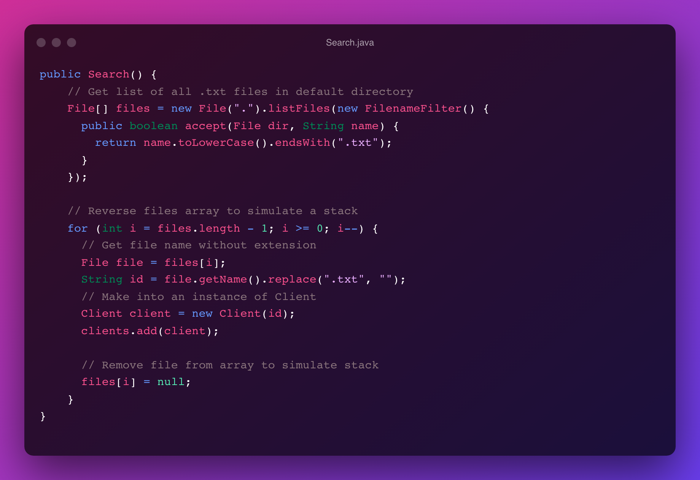
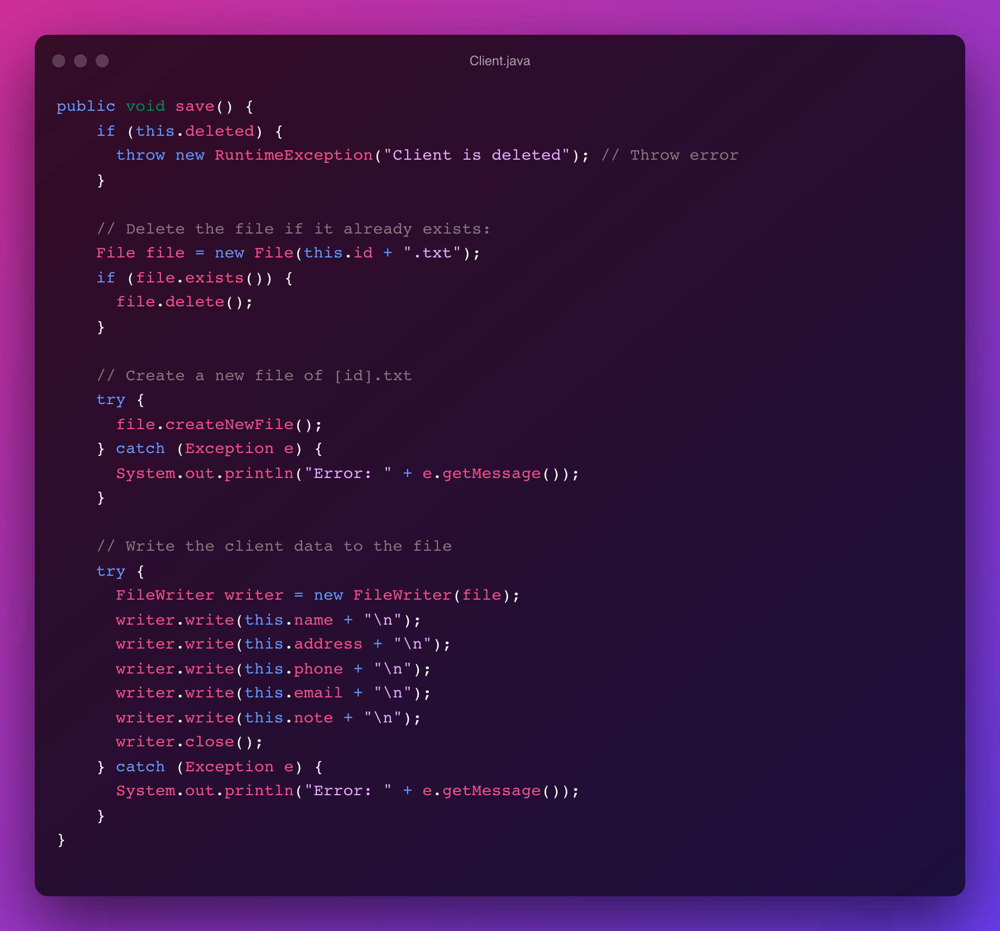
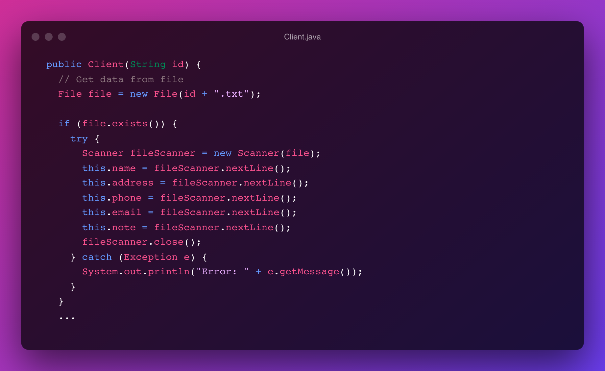
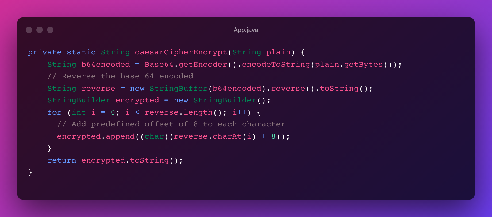
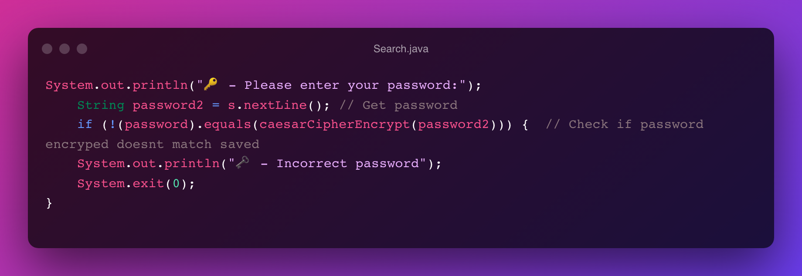

# <b>Write-up</b>

<small>Rohin Arya, Y11 HL DP Computer Science, May 31</small>

- Client Search
- Persistent Data Management
- Caesar Cipher Encryption

### <b>Client Search</b>
&nbsp;&nbsp;&nbsp;&nbsp;The purpose of including a client search is to meet a requirement set by the client. The search feature allows the user to create a series of "filters" which can blend together to produce a list of clients. The process of adding a filter is shown below:

&nbsp;&nbsp;&nbsp;&nbsp;The `addFilter` method includes three parameters: index, filter, and skipFilterAdd). The index parameter determined which field to match the filter parameter to. The final boolean parameter determines whether to skip adding the filter to the list of filters. When refreshing the search (reading from the list of filters and applying them), this is set to `true` in order to prevent double counting each filter.

&nbsp;&nbsp;&nbsp;&nbsp;Next, for every client in "clients" (`Client client : clients`), the relevant client data is fetched using a "get" method in the Client class and if it includes the search query (`filter`), it is appended to the `filteredClients` array list. Then, it is displayed to the user along with options to manage the client.

&nbsp;&nbsp;&nbsp;&nbsp;Jumping back to the beginning, when a new instance of `Search` is created, the following constructor runs:

&nbsp;&nbsp;&nbsp;&nbsp;Firstly, an array containing type `File` is created with a list of files using a `FilenameFilter` that accepts `.txt` files only<a href='#1'>[1]</a>. This array is intended to be a stack and performs as a stack. Another way of modelling first-in-first-out is looping backwards through the array. For each file, an instance of `Client` is created and added to the `clients` ArrayList. Finally, to simulate the `pop()` functionality of a stack the `files[i]` reference is set to null.

&nbsp;&nbsp;&nbsp;&nbsp;This shows algorithmic thinking by leveraging multiple data structures, loops, and more to create a powerful layered search feature.

### <b>Persistent Data Management</b>
&nbsp;&nbsp;&nbsp;&nbsp;A very important requirement for the client is to ensure the data is persistent. This means that the data is preserved between system restarts. In order to fulfil this requirement, the data must be stored on a persistent data management system such as a disk, either locally or in the cloud (ie. Firebase). To keep the program quick and to preserve privacy, storing data locally is ideal. Conveniently, Java provides useful libraries and methods for this:

&nbsp;&nbsp;&nbsp;&nbsp;Pictured above is the encapsulated save method for saving client data to disk. Firstly, a `RuntimeException` is thrown if the client is already deleted. Next, object `file` of type `File` is created which contains the file that stores the client's data. If it exists, it is deleted because the data to be replace it is more recent. Finally, a `FileWriter` is created to save the client data to the file. This is wrapped in a try-catch block to ensure proper error handling. 

&nbsp;&nbsp;&nbsp;&nbsp;On initialization of an instance of Client (in the constructor method), if the file exists, the file is read using `FileScanner`, and the data is moved into the respective instance fields. Then, importantly, `fileScanner.close()` is called to avoid a memory/data leak. Once again, a try-catch block is used in the event `fileScanner` throws an exception.

&nbsp;&nbsp;&nbsp;&nbsp;This shows algorithmic thinking by leveraging file scanning, error handling, and more to efficiency and effectively read/write relevant data to the disk in a modular fashion.

### <b>Caesar Cipher Encryption</b>
&nbsp;&nbsp;&nbsp;&nbsp;It is a common shortcoming of software is storing users' passwords in plain text on the disk. The reason why is that any malware or bad actor can easily view the password since it's not encrypted. In order to combat this, I created a simple encryption algorithm based on the common caesar cipher. 

&nbsp;&nbsp;&nbsp;&nbsp;Firstly, using the built-in Java `base64` library, the bytes of the password (`plain`) is encoded using the base64 algorithm. Then, using `StringBuffer`, the base464 encoded string is reversed. Finally, each character of the reversed string is looped through in order to build a new string with `StringBuilder` such that each character is offset by 8. This works because characters in Java have an integer equivalent. 

&nbsp;&nbsp;&nbsp;&nbsp;In order to validate a password against this, the following is used:

&nbsp;&nbsp;&nbsp;&nbsp;Since using the same seed phrase (password) always results in the same final encrypted value, simply encrypting a proposed password and comparing it with the encrypted form of the existing password is a secure way to validate the password. This way, there is no need to ever decrypt the password which may expose security vulnerabilities. There are many limitations to this however. For example, would could simply read the files from disk directly rather than using the program. While imperfect, and relatively simple to crack, the caesar cipher is a good proof of concept for making local data more secure.

&nbsp;&nbsp;&nbsp;&nbsp;This shows algorithmic thinking by using a series of methods to scramble a passphrase. Further, securely verifying the password against the saved string.

1: WhiteFang34. (2011, April 22). Using File.listFiles with FileNameExtensionFilter. Stack Overflow. Retrieved June 3, 2022, from [https://stackoverflow.com/questions/5751335/using-file-listfiles-with-filenameextensionfilter/5751357#5751357](https://stackoverflow.com/questions/5751335/using-file-listfiles-with-filenameextensionfilter/5751357#5751357).

