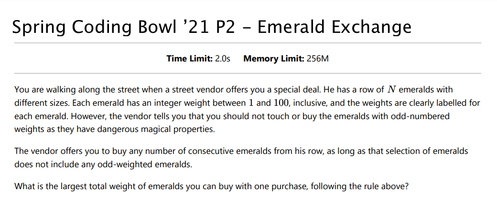
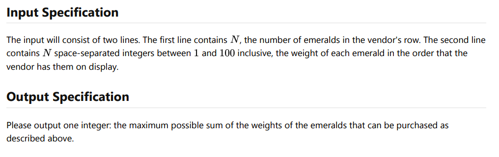

  <b>Criterion C - Creating</b>
    

Y10 Design
Rohin Arya
May 17, 2021

### Teaching Artifacts

#### #1

 

#### #2
Problem Overview

Problem Details

 

#### #3

 

#### #4 (Uploading)
 
https://docs.google.com/presentation/d/1Wg5Cvb1L6e9y4uvvkfFn7AU2PSVHhWnc5uQyPI2Tk8M/edit#slide=id.gd946538ba8_0_31

#### 5
 