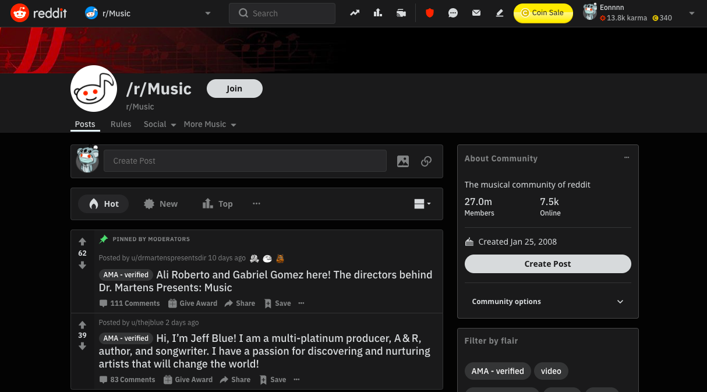
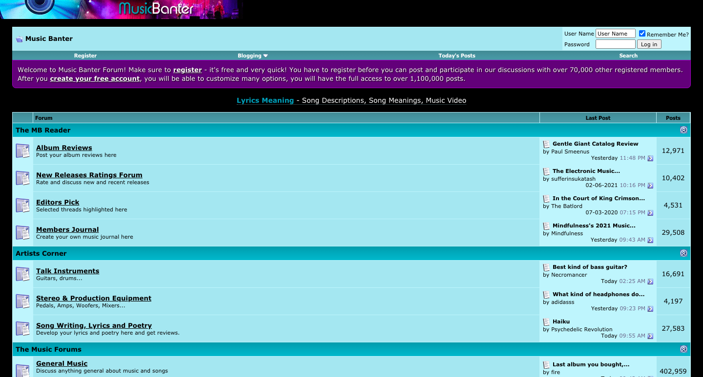
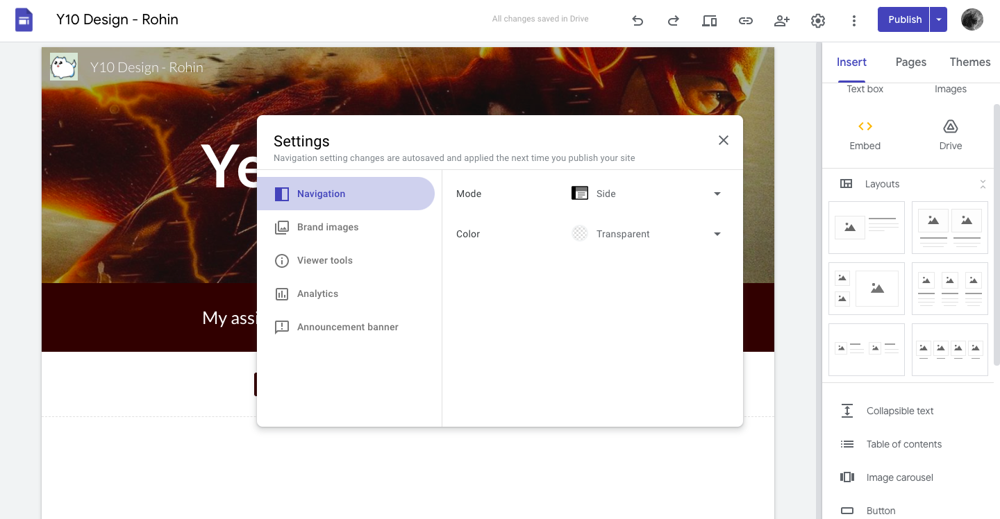

  <b>Criterion A - Inquiry</b>
    

  Y10 Design  
  Rohin Arya  
  April 6, 2020  

### 1. Need for Solution

68% of adults said they listen to music every day. This is a large group of people with many looking to share their thoughts on such a common topic. This problem has been contemplated many times and there are already some solutions. However, there are many problems with these existing solutions which will all be explained later. Reddit's r/music has more than 27 million members with shows the significant demand for a product like this. I found that the majority of friends I consulted, would use a platform to discuss their favourite songs frequently!

The intended userbase is simply music listeners who want to talk about their favourite songs. Since there is a demand and lack of a proper solution, there is a good opportunity to create a product that does exactly this! Since the product will be built around my ideas, I am my own client. In this case, I don't know specifically what users will want. Thus, design and technical choices will be based around external feedback. In conclusion, this product will serve this group by providing a sufficient platform to speak about these songs. It will also aid these people by connecting them with other like-minded individuals who share their taste in music.

### 2. Research Plan (Topical)

| Value | Topic | Reason | Primary/Secondary |
| - | - | - | - |
| #1 | Music Platforms | In order to properly complete my research, I will need to first properly understand the user-app dynamic. Common practices, monetization elements, and playback-related standards will be crucial in creating my own features related to this genre.| Primary: https://open.spotify.com/, http://music.apple.com/ Secondary: http://blog.idonethis.com/spotify-growth-mindset/|
| #2 | Music Copyright | Looking at Spotify's music playback system, it seems like copyright fees are the largest expense and the reason they are still losing money. I will need to look into this very closely to find out if this platform will even be legal or whether content licencing will be required. | Primary: https://www.copyright.gov/title17/  Secondary: https://blog.songtrust.com/how-spotify-streams-turn-into-royalties|
| #3 | How Forums Work | Internet forums have existed for decades and attract people of all kinds. From 2010 chat rooms to Twitter, there is a very large gap in my knowledge about how these forums are run, moderated, created and managed. Learning this will help me with my own music forum. | Primary: https://redditblog.com/, https://reddit.com, https://twitter.com  Secondary: https://www.businessinsider.com/how-twitter-was-founded-2011-4, https://www.engadget.com/2020-02-27-internet-forums-dying-off.html|
| #4 | UX | UI/UX design thinking is an additional topic which holds significant important for the project. A negative user interface can be a large reason for users to quickly leave. As such, the user interface should fine-tuned and it will be very important to conduct research on UX practices. Sites like dribbble and behance provide many examples of stunning UI designs and will be used for inspiration. | Primary: https://dribbble.com, https://behance.com Secondary: https://www.entrepreneur.com/article/309161|
| #5 | Content Moderation | Large social companies such as Twitter, Facebook are constantly under attack for their content moderation. Ensuring that I am aware of these practices and the controversies surrounded | Primary: https://help.twitter.com/en/rules-and-policies/twitter-rules  Secondary: https://www.cnbc.com/2021/02/27/content-moderation-on-social-media.html|

### 2. Research Plan (Technical)
| Value | Topic | Reason | Primary/Secondary |
| - | - | - | - |
| #1 | JavaScript | The product fundamentally consists of JavaScript. JS will be responsible for all logic including front-end related things like dynamic page content, etc. Additionally, cloud functions are written in JavaScript to provide backend functionality as well. | Primary: https://developer.mozilla.org/en-US/docs/Web/JavaScript, https://devdocs.io/javascript/ Secondary: https://www.freecodecamp.org/news/the-advantages-and-disadvantages-of-javascript/|
| #2 | Firebase | In order to create the cloud functions, authenticate users, create a database and use other backend functions like these, I will be using the services of Firebase as described in this unit. Because of this, the development time will be greatly reduced. | Primary: https://firebase.google.com/, https://firebase.google.com/docs  Secondary: |
| #3 | HTML | To create the front end in the Electron app, I will be using Hyper-Text Markup Language to build components. As learned in class, this will create prebuilt elements as well as some container elements for use by the JavaScript code. Generally, this is a very structural component to the application / website.  | Primary: https://developer.mozilla.org/en-US/docs/Web/HTML  Secondary: https://www.w3schools.com/html/ |
| #4 | Electron | Next, Electron will be important. In terms of priority, this platform can be adapted into a standalone website just fine but it will greatly improve the experience if it was built into the electron app. Learning electron will allow me to easily package the app into a desktop app compatible on Windows, MacOS AND Linux easily.| Primary: https://www.electronjs.org/, https://www.electronjs.org/docs/tutorial/quick-start  Secondary: http://man.hubwiz.com/docset/electron.docset/Contents/Resources/Documents/docs/tutorial/first-app.html |
| #5 | CSS | Another structural technology to learn is CSS which will dictate how the elements look on the page. In this day and age, it has never been more important to ensure products look sleek AND modern. Sometimes, a bad-looking UI is enough to turn away a user instantly. This is why, it will be important to invest in a good-looking interface. | Primary: https://developer.mozilla.org/en-US/docs/Web/CSS, https://devdocs.io/css/ Secondary: https://css-tricks.com/, https://css-tricks.com/snippets/css/a-guide-to-flexbox/|
| #6 | Spotify API | Although playing music is not the most important feature as many of the products below do not use this feature, it will be a cool, unique feature. The goal is to list songs and play songs based on which topic the user is in. Because it is not 100% integral, it is not so important compared to the other topics but it will still be a neat feature which I am looking to add. | Primary: https://developer.spotify.com/documentation/web-api/, https://developer.spotify.com/  Secondary: https://blog.prototypr.io/have-you-heard-about-the-spotify-web-api-8e8d1dac9eaf?gi=fe8657b156c4|

### 3. Product Examination
<b>/r/Music</b>

| Pros | Cons |
| -- | -- |
| - Many active users | - Users must be on Reddit |
| - Very easy to find | - Unorganized |
| - Daily discussions | - Performance is not optimized|
| | - Cannot play music |

r/Music is one of the most popular music discussion forums boasting more than 27 million members. Its easily discoverable due to Reddit's large influence and it being promoted all over their site. There are millions of active users with daily discussions, comments, frequent posts and more. Keeping these benifits in mind will be integral. However, with that being said, it is also important to consider the drawbacks. Firstly, each user must already have created an account on Reddit in order to interact. Secondly, the posts are unorganized due to Reddit's simple nature. Each post is displayed one after another with no grouping based on song/artist. As such, it is difficult to speak about a specific song if it's not very popular. Thirdly, reddit is not optimized. The new redesign is heavily critized for being performance-heavy and downloading many unnecessary resources. This ties in with the first point in that this community largely restricted being that it is simply a grouping on the parent platform: Reddit. Finally, the platform cannot play any music besides limited inline youtube embeds (which aren't always available). Thefore, despite r/music being a flourishing community of passionate musicians and listeners, there are fundamental problems which prevents it from expanding beyond Reddit.

<b>The Music Banter</b>

| Pros | Cons |
| -- | -- |
| - Many active users | - Very bad design |
| - High on Google | - Cannot play music |
| - Lots of topics | |
| - Good performance ||

The Music Banter is another very popular music forum which labels itself as "The Internet's Top Music Community". It also has thousands to hundreds of thousands of posts in each topic. Firstly, there are many active users which is required to create an product that people will use more than once. Secondly, the website ranks very high on Google. This is very important as search engines are the main source for many websites' traffick and provide a gateway to millions of users. Thirdly, there is an abundance of topics, from musicians sharing their work to discussions about new releases, there are many groupings of posts to choose from. Finally, the UI is extremely performant and does not require much compute power to run quickly. Unfortunately, there are large issues with this. Firstly, the UI is extremely outdated and basic. Though this is likely the reason for the website's high performance, I do not believe it is worth it due to the lack of a good user experience. The outdated UI might also immediately push some users away who are used to more friendly and modern user interfaces. Finally, similarly to the previous sample product, the platform does not play music besides rare YouTube embeds which does not add to the user experience. In conclusion, despite The Music Banter being a well-organized and active community, it is held back by their outdated UI and lack of outstanding features.

<b>Google Sites</b>

| Pros | Cons |
| -- | -- |
| - Very high ranking on Google | - Unrelated to music |
| - Material Design system | |
| - Consistent and fluid ripple effect  | |
| - Good performance ||
| - Frequent Updates ||

Google Sites is a website-creation platform designed by Google. Although unrelated to music in general, it does have stunning components that could be used as inspiration. Since the product is unrelated to music, the content and purpose of the webapp should be overlooked, but this does not detract from the exceptional UI. Firstly, similarly to the previous example, this website ranks extremely high on search engines which suggests that the platform contains an abundance of users. Next, the site executes the Material Design system very well, closely following the guidlelines. With this, there are consistent features like the fluid ripple effect used on buttons, dropdowns, etc. These touches add micro-interactional consistency and significantly aid the user experience. Finally, the UI is frequently updated with many new features added. This benifit is always good to keep users on the platform. Therefore, Google Sites employs legendary design and consistent upkeeping to keep users happy on the platform. This type of management can certainly be useful to keep in mind while creating my own project.

### 4. Design Brief

The design brief primarily contains references to aspects of the design based on research and products anlyses. 

#### Reference 01: UI
As previously mentioned, a good user interface is very essential in creating a usable product for the general public. Because of this, I will be using the Material Design Guidelines to inform decisions about the design. As seen in the product anlayses, I mentioned that the Google Sites dashboard page had an outstanding UI because of it's accurate model of the Material Design system. The guidelines are available at <a href="https://material.io/design/foundation-overview">material.io</a> which outline some of the design principles that will be helpful in creating a good-looking UI appealing to users.

#### Reference 02: Feature-Set
A large portion of Criteron B's success criteria may be based on specific features. These features will separate the product from the other competition as described in the previous section. The current features to distinguish the product from others are simply to create a new forum for each song on the Spotify library.

#### Reference 03: Implementation & Users
A commonality in successes with all the music-related product analyses is that there were an abundance of users eager to particpiate. I forsee this being the largest challenge in this application. In order to keep the forums active, I will need to implement it into the rest of the app successfully. Perhaps along with the friends list in order to create a more social aspect or something like this.

#### Reference 04: Speed
Finally, to promote a high quality user experience, I will focus a lot on speed and performance of the application. The Reddit forum flaw is that the whole website loads very very slowly on average computer with average internet speeds. This is what leads many users away from the platform such as myself and people I've talked to about it. The solution that will be included in my own product is to keep everything lightweight and optimized to ensure that nothing is being loaded unnecessarily and only loading features as you use them instead of all at once.

#### Reference 05: Comments Forum
Another important feature that I noticed with these forums is that it is less like a robust social media and more like a clunky wall of posts. This is because everytime you are talking with someone, you must refresh the entire page every time to fetch new messages. On sites like Reddit, the problem is compounded by having slow loading speeds. On my product, I will be using Firebase Cloud Firestore Listeners in order to update the post when new data is added allowing multiple users to have a live, vivid conversation. 