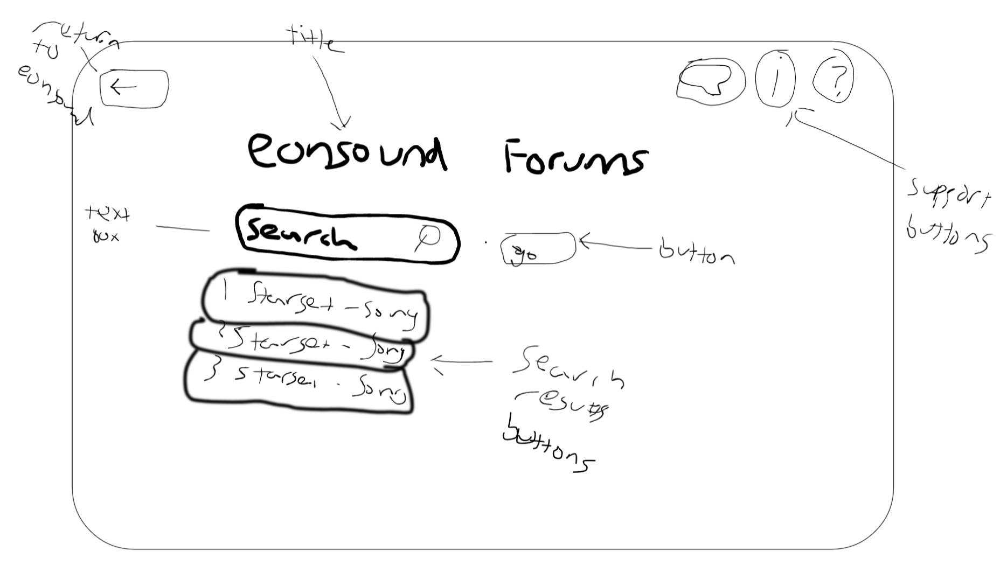
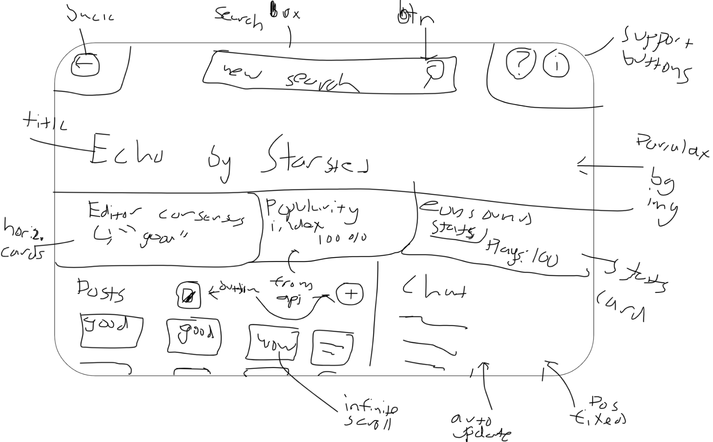
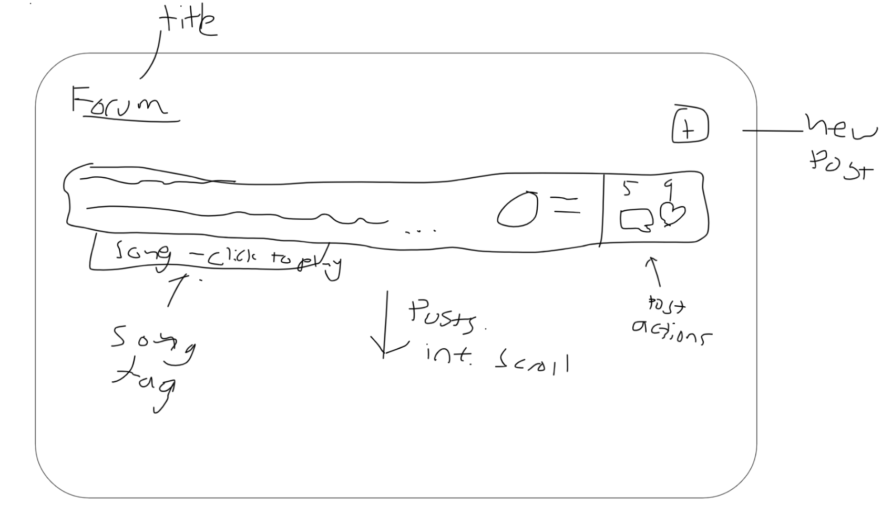
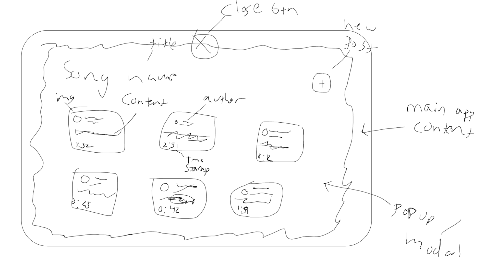
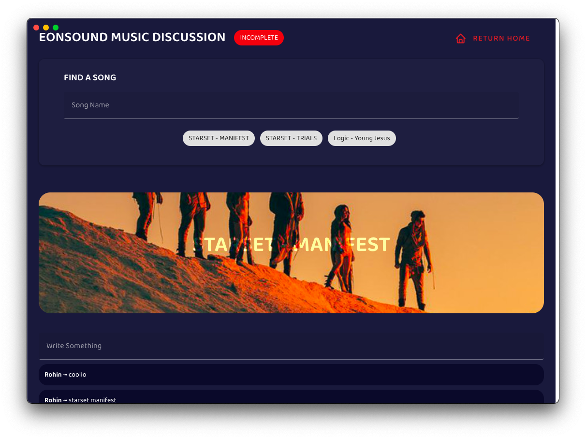
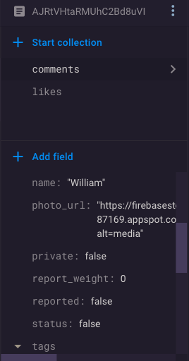

# Designing Data | Criterion B
## Developing Ideas
### Part One | Detailed Success Critera

| Topic | Critera | Evaluation | Justification |
| - | - | - | - | 
| UI / UX | - Colors are consistent and respect the user's theme, (Dark blue background in dark mode, primary color by theme, etc).<br>- Colors are consistent across the UI.<br><br>- Closely follows Google's Material Design specifications which outlines details about specific elements such as buttons, cards, etc.<br><br>- All buttons and icons are easily identifiable and it is easy to tell their purpose.<br><br>- The product is reported as easy to use and good looking from users.  | A survey will be given to random users with questions such as, "Is the UI appealing to you?", with Y/N answers. Users report a high quality music and library experience.| User interface is very important to a software solution's success. From my own experience, if an app does not have an appealing UI, I am less likely to use it. This mindset is shared with many users and many potential users of this application. UX is another important critera for a website's success. To ensure users' are having a good experience using the website, feedback surveys will be conducted. If the user is not having a good experience while using the website, there is obviously no reason to continue using it which is not good.|
| Discovery Functionality | - Search field works and returns data about the song.<br><br> - There are buttons with trending searches in order to provide example searches.<br><br>- Potential resuts include the entirety of the Spotify library.<br><br>- Account authentication is secure and functional so that users cannot search until they are signed in. | This criteria is measurable and so to evaluate, I will select yes or no for each of the criteria elements and justify. | Discovery is important to any application, however, since this product is largely based around user searches, it is especially important that the experience is both possible and high-quality.|
| Commenting Functionality | - Possible to comment in any song's forum.<br><br> - Comments / posts are laid out in sequentially automatically. <br><br>- Comments update immediately to provide a more immersive and reactive experience| This peice of functionality will require that users are actually able to provide their thoughts and read out people's posts about music. This feature will thereby complete the mission of the application itself and could easily be labelled the most important feature. | Similarly to the discoverability functionality criteron, the points listed to the right can be objectively measured which is why I will be evaluating them with a simple yes/no + justification.|
### Part Two | Design Ideas
#### Idea One
This idea is very unique in that it shows a design with a large front-facing title. This gives immediate context to the user. Underneath, there is a large search bar to search up a song. After it is selected via a dropdown menu, the search bar and other elements will be removed and the actual forum-related content will be shown. This includes posts, profiles, etc. 

Home page:

After selecting a song:


#### Idea Two
This idea is similar to previous sites where all posts are visible across the platform. With this, the songs are included simply via tags and are able to be played on a click. With this idea, it will be more familiar if the user has used any other type of forum software.



#### Idea Three
Similarly to Idea Two, this idea will be build directly into the main app. There will be an option in the song's context menu to open a sidebar containing all the forum-related features there. This will be interesting because the user will not need to go somewhere else to access the forum topics and can instead use the app normally. This concept reminds me a lot of a comment system where each song can have some 'comments' system.



### Part Three | Chosen Design
<p>I've chosen <b>Design #1</b> for the inspiration for the solution because of a few reasons.</p>
<p>
Firstly, it's <b>unique</b>. A forum with unlimited topics is not very common and I have never seen it before. Topics are usually standardized and all posts fall into a predefined category. This idea will have millions and millions of categories and topics since each song will have it's own discussion.
</p>
<p>Secondly, it has a high degree of <b>user-experience</b>. ...Or at least, I think it will. I believe it will be much easier to understand a simple "talk about your favourite song" rather than having to understand how all the forums topics work together to create a separate experience. If I were the end-user, i'd rather not get too involved with traditional forum software and instead treat it more of a discussion element.</p>
<p>Finally, it is <b>feasible</b>. Some features of the other designs require a high degree of knowledge. Things like proper post discussion, WYSIWSYG editors, and more are tools beyond the scope of my research. I believe it is important to decide on an idea that I can complete cofidently and thoroughly than a half-baked idea that doesn't work well with the rest of the app and is not very optimized.</p>

<h4>Success Criteria</h4>
The points outlined in the success criteria are demonstrated in this design. Looking at the black & white design as well as the HTML mockup below, the colors are consistent with user themes/ Additionally, most icons are supported with text to avoid confusion. When consulted with friends and personal opinon, the response was generally that the design looks good. User experience is diffucult to measure with simply a design however which leaves potential room for error.

<h4>Designed in Greyscale</h4>
According to my favourite UI design book, "<a href="https://www.refactoringui.com/book" target="_blank">Refactoring UI</a>", By designing in grayscale, you’re forced to use spacing, contrast, and size to do all of the heavy lifting." While color is important, my intial designs were planned with other design hierarchical systems such as spacing. As part of my chosen design, I created a colored HTML mock-up of how the design might look in order to consolidate ideas.




### Part Four | Planning Materials

#### 01
I've created a database structure in Firestore of what the posts could look like this. This will be the most scalable as I have recieved guideance from experts from within the field such as a prominent official Firebase developer and community member.


#### 02
As shown in the previous section (Inquiry and Analysis), here are some code snippets for async/await and es6 array functions.
```javascript
async function() {
  // One line to call firebase
  data = await firebase.firestore().collection('app').doc('music').get()
}
```
```javascript
callbackFunction((params) => {
  //
})
```

#### 03
Here is the link to a snippet of my demo social media project I created in preparation for this. <a target="_blank" href="https://raw.githubusercontent.com/r0hin/echo/master/app/js/home.js">r0hin/echo/app/js/home.js</a>

It includes code such as 

```javascript
query = await db.collection("timelines")
  .doc(user.uid)
  .collection('posts')
  .orderBy("timestamp", "desc")
  .startAfter(lastVisibleRel)
  .limit(8)
  .get()
```

where the code performs a Firebase Firestore query to gather relevant data in the correct order and format. 

#### 04
Another code snippet has to do with Firebase Authentication. This code checks if the user is signed in and will perform an action based on it.

```javascript
firebase.auth().onAuthStateChanged(function (user) {
  if (user) {
    // User is signed in.
    window.user = user;
  }
})
```

#### 05
Since the playback code will largely be the same as the one used in the main EonSound app, I can reuse the following code with slight modification.

```javascript
async function playSongs(Id, externalData) {
  // Playlists will have sufficient data
  // Albums wont
  if (externalData) {
    // Allow for passing in external data
    musicDataPlay = externalData
  }
  else {
    // Use data from ID
    musicDataPlay = queueData[Id]
  }
  
  for (let n = 0; n < musicDataPlay.length; n++) {
    const playSongsSong = musicDataPlay[n];
    if (playSongsSong.url) {
      if (n == 0) {
        // Play it. (Clear queue and play first song)
        await playSong(playSongsSong)
      }
      else {
        // Queue it
        await queueSong(playSongsSong, true)
      }
    }
    else {
      if (n == 0) {
        // Play it. (Clear queue and play first song)
        await playSongWithoutData(playSongsSong.id)
      }
      else {
        // Queue it
        await queueSongWithoutData(playSongsSong.id, true)
      }
    }
  }
  
  if (musicQueue.length > 0) {
    $('#showQueue').removeClass('hidden') 
  }
  
  visualQ_build()
  
}
```

<center>
<br><br><br><br>
End 🌴
</center>