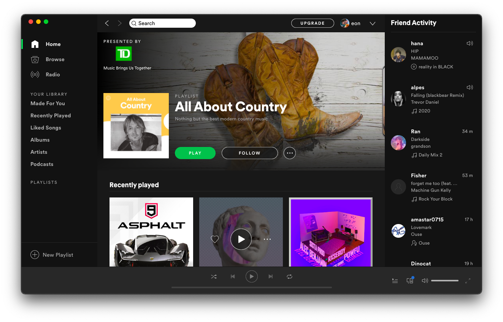
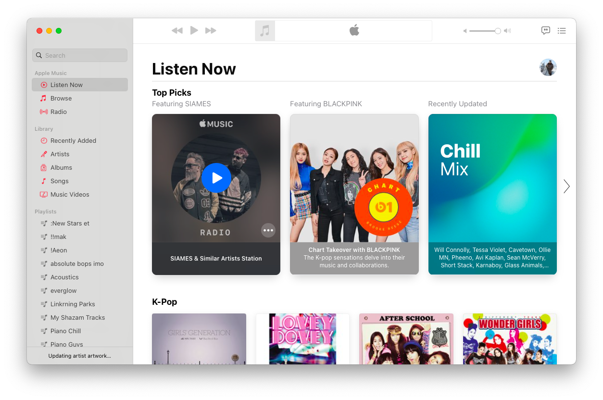
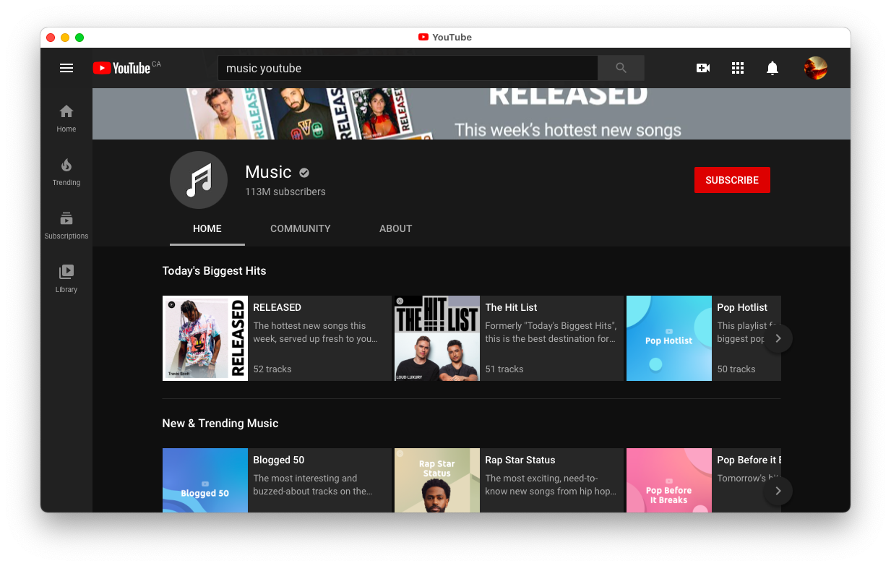

# Designing Data | Criteria A

### Part One | Need For Solution

Listening to music is fun. There are more than 278 million people with an active subscription to music services. Additionally, music streaming as an industry hit more than 11.4 billion U.S. dollars in revenue worldwide. That's a lot of money and there are many people happy to pay $10 a month for unlimited streaming - but imagine if there was an alternative. If there was a beautiful, well-crafted and well-designed application to listen to millions of songs for free for life. That is where my solutution comes in. As someone who enjoys listening to music, I can empathize with those whose parents may not have an active family subscription or if you just don't feel like spending the money. While $10 a month doesn't seem like much, 78% of workers in the U.S. are living paycheck to paycheck and saving a few hundred extra bucks a year could come in handy. 

### Part Two | Research Plan

Enter, "EonSound" - the revolutionary new music streaming service. To build an app like this, I will need to learn or have learned the following technologies on top of basic fundamentals such as HTML, CSS, and JavaScript:

- [ ] Firebase (Database, Cloud Functions, Authentication, and Storage) 
- [ ] Electron (Cross-platform Desktop Apps) 
- [ ] Spotify API (Search Songs, Track Information, User Playlists) 
- [ ] YouTube API (Search Videos, Download)  
- [ ] Node.JS (Return Song URLs, Package "firebase-admin", etc) 

I am somewhat familiar with these technologies but in order to create a good user-experience, I will need to learn each of those more in-depth and practice them more.

### Part Three | Product Examination

<b>Spotify</b> is likely the most popular streaming service and can be useful to be knowledgable in the "spotify experience" when building this app.

| Spotify Pros  | Spotify Cons |
| ------------- | ------------- |
| Well-known and secure| UI could be improved |
| Large library of music | Shows ads or $10/mo |
| Shows music from friends | |
| Music recommendations | |
| Desktop, Mobile, TV, etc | |

<b>Apple Music</b> is another good option when it comes to music streaming. They came after spotify but have a good product to learn from.

| Apple Music Pros | Apple Music Cons |
| --- | --- |
| Legendary UI | Only available on Apple devices |
| Music recommendations | Has less of a social aspect|
| Large library of music | Costs $10/mo to use |
| Fun features such as live lyrics | No free-tier with ads |
| Very easy to use | |

<b>YouTube</b> is primarily a video platform but many people use it for music as well. They have a dedicated music app which nobody uses, but do have a lot of content on regular YouTube.

| YouTube Pros | YouTube Cons |
| -- | -- |
| Music videos + music | Ads without premium|
| Very large library | Slow compared to others |
| Material Design | No official desktop app |
| Popular and well-made | |

### Part Four | Design Brief

### Part Five | Possible Additions