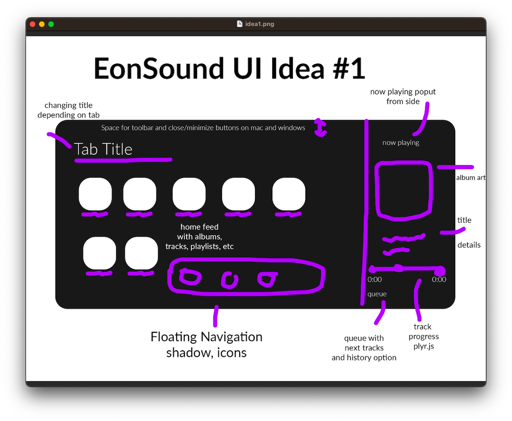
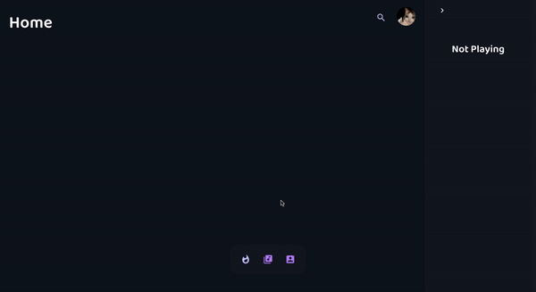
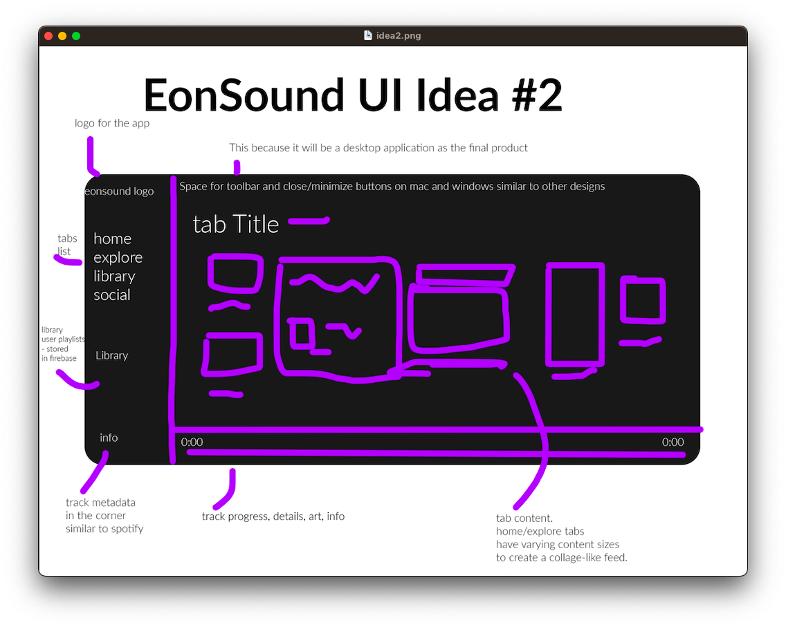
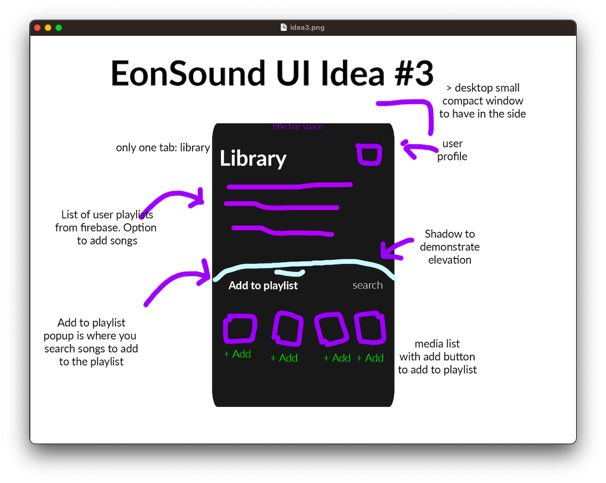
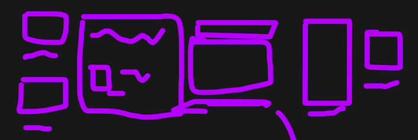
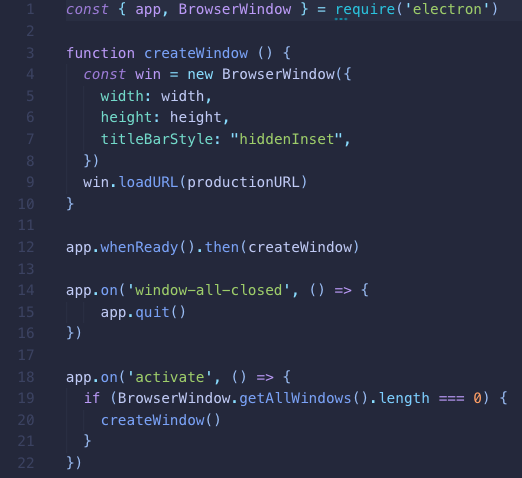
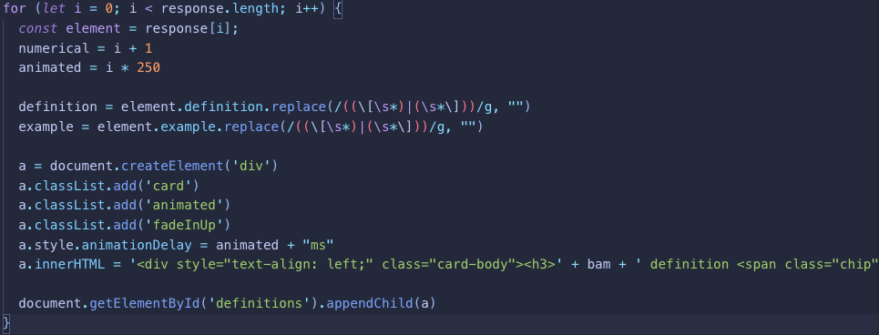

# Designing Data | Criteria B

### Part One | Success Critera

This success critera will outline the terms for the solution to be considered a success.

| Request| Critera | Evaluation | Justification |
| - | - | - | - |
| User Interface | - UI looks very appealing. - Colors are consistent across the UI. - Closely follows Google's Material Design specifications.  | A survey will be given to random users with questions such as, "Is the UI appealing to you?", with Y/N answers. | User interface is very important to a software solution's success. From my own experience, if an app does not have an appealing UI, I am less likely to use it. This mindset is shared with many users and many potential users of this application. |
| Functionality | - Music can be played.  - Users can intuitively search for and find songs. - A flexible library system is provided. - Account authentication is secure and functional. | The criteria is measurable and so to evaluate, I will select yes or no for each of the criteria elements and justify. | Good UI is useless when there is no functionality of the app. Since the app is a dedicated music finder and player, it is important to build functionality around these features to improve the overall experience. |
| Publication | - Application loads quickly.  - Application is properly packaged for MacOS, Windows, and Linux via Electron. | For load times, it must load on average 3s or less on a stable internet connection (UCC Wi-Fi) because of <a target="_blank" href="https://www.marketingdive.com/news/google-53-of-mobile-users-abandon-sites-that-take-over-3-seconds-to-load/426070/#:~:text=New%20research%20by%20Google%20has,seconds%20on%20a%204G%20connection.">this article's summary</a>. Rest of the critera are y/n answers and will be evaluated alongside a justification.| Ensuring the app is easy to install and able to be installed on as many users' computers as possible is important as without an easy way to install the app, very few people will actually be using the solution. By building it cross-platform, it will allow the most number of people to use this application. |
| User Experience | - App is easy to use according to users.  - Button actions are easily understood with icons or context.  - Users report high quality music and library experience. | This will be evaluated via a secondary form with questions such as, "Is the audio of high quality?", given to at least 5 people.| UX is another important critera for an app's success. To ensure users' are having a good experience using the app, feedback surveys will be conducted. If the user is not having a good experience while using the app, there is obviously no reason to continue using it which is not good. |

### Part Two | Design Ideas

#### Idea One

This idea is unique since I have not seen it done before. It includes a sidebar on the right side that pops out with the now playing track and the queue information. The navigation is floating on the bottom with a few tabs where the background is the content which changes based on what the user is doing, ie. searching, browsing, etc.

In addition to this, I created a demo in HTML and CSS to demonstrate how the tabbing system could potentially work:

#### Idea Two

This idea is very similar to spotify as it contains a sidebar with the user's library such as playlists. All content is very easy to access and the now playing fills the bottom portion always. A custom feature I added was the dynamic content which looks similar to a maisonry-type layout. A potential downside to this is that the library is loaded when the app is loaded which could increase loading times whereas the other designs have the library lazy-loaded to cut the initial load times. 

#### Idea Three

This idea is very unique as it completely changes how the app would be used. This would make the application a smaller window which could put on the side and exclusively show the library with options to search and that's it. This looks good since it is very minimal and no unnecessary features. It is also a very unique design and could start a new trend with this type of compact, minimal design.

### Part Three | Chosen Design

The chosen design is design #1 which looks like this: 

Since I am the client and user of the app as of now, the reasons I chose this are as follows. 

<b>It's simple</b>. If you have used a music streaming platform, it would be very easy to learn how to use this application. At the same time, it is not exactly like previous streaming platforms. Instead of having a design like #3 where it challenges the norms of the music streaming experience, it provides slight change bu eliminates the learning curve which will allow it to be used by more users.

<b>It's unique</b>. Despite having no learning curve, it is unique as the popout sidebar and floating navigation has never been done before. Although these are new components, they are present in other types of websites and users' will not have a problem adapting to these elements. 

<b>A blend</b>. The chosen design isn't actually exactly like the design specification. After consulting with other potential users such as John Liu, a fellow programming student, I have decided to implement the masonry-type layout of #2 into this design. As of now, the content takes a grid layout but the dynamic content size would look very nice. Here is an image of the dynamic content size:

As you can see, it could have a very nice place in design #1.

### Part Three | Planning Materials

In order to execute this design, there are some planning-related prerequisites including code snippets, assets, and more. All of which are shown here:

<small>Note: Code snippets are in image form but are copy-pastable <a target="_blank" href="https://raw.githubusercontent.com/r0hin/design/master/Y10/summatives/designing-data/assets/b_snippets.txt">here</a>.</small>

#### Electron Boilerplate

#### EonSound Logo

#### Accessing APIs

I have practiced my API skills by creating the following small webapps (Some require updates, open source <a target="_blank" href="https://github.com/r0hin/r0hin">somewhere here</a>, <small>mind the disclaimers</small>):

<a target="_blank" href="https://r0h.in/?a=trumpy">Random Donald Trump Quote</a> (Cannot verify poltical correctness)
 
<a target="_blank" href="https://r0h.in/?a=joke">Joke Generator</a> (Cannot verify unoffensive jokes)
 
<a target="_blank" href="https://r0h.in/?a=urban">Urban Dictionary Client</a> (Cannot verify appropriate definitions) 
<a target="_blank" href="https://r0h.in/?a=movie">IMDB Viewer</a> (Cannot verify appropriate films)

#### Looping through API Data and Building Elements

Thanks for reading 😎 !
