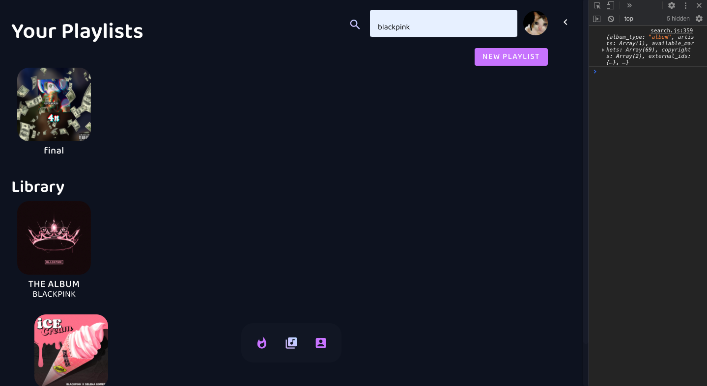
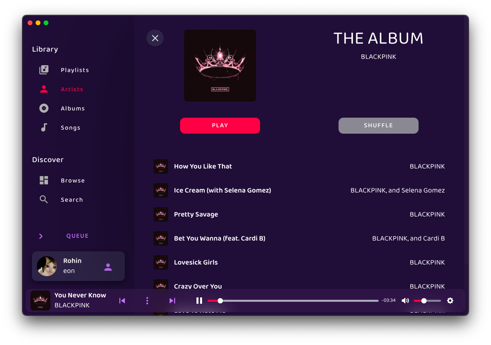

# Designing Data | Criterion C
## Creating the Solution
### Part One | Plan ⏰

| Date 📅| Prediction ✨ | Progress 📈 |
| - | - | - |
| Sep 18| - Project structure - Setup Firebase and cloud projects - Setup Firebase Hosting | ✔ Setup project, hosting, etc for development |
| Sep 19 - Sep 21 | - Build Basic UI including tabs  - Add authentication with Firebase Auth  - Basic account details shown in a clean UI |  ✔ Auth ✔ Cloud function to manage account creation details
| Sep 22 - Sep 25| - Work on search and library-based items   - Build some cloud functions for auth, image management, etc|  ✔ Search UI ✔ Error handling ✔ Completely redid code to play songs - should bypass georestrictions|
| Sep 25 - Sep 30| - Complete song download and return url to client   - Add more features to the app  - Setup Electron|  ✔ Electron ✔ Now playing + animated player ✔ Scroll issues fixed|
| Sep 31 - Oct 3| - Work on the playing UI with song history, queue, etc  - Use JS Library called PLYR for a better looking audio experience |  ✔ Context menu ✔ Play playlists ✔ Set indentation to 2 spaces (big improvement from 4)|
| Oct 4 - Oct 7| - Work on more media types such as playlist, album, track and artist  - Create views for each |  ✔ Added spotify playlists support ✔ Improved contexts |
| Oct 8 - Oct 15 | - Add user playlists and general structure for it   - Allow adding songs to playlist which keeps the URL for instant playback  - Improve media full screen view  - Don't accidentally lose a lot of code and redesign everything.| - Redesigned the whole project  - 😡|
| Oct 16 - Oct 19 | - Enhance electron app and try to add link previews to open in the app  - Improve UI drastically and add animation libraries | ✔ Created music queue and now playing ✔ Rebuild context menus to look better  |
| Oct 20 - Oct 24 | - Create queue, music controls, queue list of tracks, library (add track,library,album, etc to library) - Color thief library to grab main colors from image and construct playlist details with those colors Might look cool | ✔ Album to library ✔ Song to playlist ✔ Album View|
| Oct 25|- Improve all features generally and make it more integrated Things like speed, effeciently, UI improvements and final touches like that |  ✔ Artist view and context menu ✔ Artist to library ✔ Redesigned media view for stacking ✔ Updated login UI ✔ Queue Tab ✔ First beta release in production ✔ Tracks in library|
| Oct 26 - Nov 3 | - Basically just enhance library, animations, etc| ✔  Built listening parties feature for listening to tracks as a group ✔ Switched icon libraries ✔ UI Bug Fixes |
| Nov 4 - Nov 7 | - Browse and first-time pages  - Add details about the app for new users   - Spotify categories options, etc|✔  Browse Page ✔ Change User Photo ✔ Updated theming system for snackbars, player, etc  |
| Nov 8 - Nov 11 | - Last touches and work on writeup for rest of time | ✔ Cateogry view and updated playlist view ✔ Context option to go to album/artist ✔ Light theme updates ✔ Able to delete playlists  ✔ Better experience with spotify playlists|
| Nov 12 - Nov 15 | | ✔ Link previews added for albums, artists, playlists and tracks  ✔ Lots of enhancements to update the library automatically ✔ Lots of bug fixes ✔ 1.0.0 first beta ✔ UI Redesign ✔ Redeveloped user playlists ✔ Able to rename playlists |
| Nov 17 - Nov 20 | - Final enhancements, push to production, 🎉 1.0.0 release | Way too many changes to fit here. <a target=")blank" href="https://github.com/r0hin/eonsound/commit/3f335a9314c1d3a39ddbe5ffee75f0da86445fa2">1</a> <a target=")blank" href="https://github.com/r0hin/eonsound/commit/11fec89866915e3f3fb01f1f2659826b6d97efc7">2</a> <a target=")blank" href="https://github.com/r0hin/eonsound/commit/cc1c1aec3d519b6e00e6f11423fd5b9cc71f877a">3</a> <a target=")blank" href="https://github.com/r0hin/eonsound/commit/e2075e604a8cfa004c07460964dc3dd1157ac35b">4</a> <a target=")blank" href="https://github.com/r0hin/eonsound/commit/5d99c3c1f76ac2c1bc0accb3d83c8c2dde1838c7">5</a> |

### Part Two | Skill Development 💪
During this project, I have improved and learned many skills. I will briefly talk about a few highlights: problem solving, syntax and experience.

2.1 <b>🧠 Problem Solving</b>

I solved many difficult problems during the project. Many were syntactic but many were very deep rooted problems that required lots of rethinking. The biggest problem I faced was how to download audio reliably. The way I had programmed it originally used a Firebase Cloud Function to use the Spotify API and a YouTube Downloader Library to download the track. There ended up being many issues with this. Firstly, it was quite slow. With cold starts, lack of processing power, etc, songs would take a while to download. Secondly, there were geo-restrictions and inconsistencies due to the nature of Google Cloud. My solution was to move everything to a heroku NodeJS web server and run it from there. This then gets called from the cloud function. Now, it works far more reliably (although still not perfect) and is faster (although not the fastest).

2.2 <b>📚 Syntax</b>

On top of learning a lot about using syntax to problem solve, I learend a lot about the code itself. I got way more comfortable with async functions, string literals and generally cleaner code throughout this project. For complex functions, I learned the value of code comments first-hand and much more. Overall, my syntactic skill developemtn here was generally along the lines of readability, conciseness and optimization of the code.

2.3 <b>✨ Experience</b>

Another important skill I developed was the experience of producing a desktop app from start to finish. I learned a lot about git, GitHub Releases and more tools to deliver products. I also learned about <a href="https://semver.org/" target="_blank">Semantic Versioning</a> and licencing. Finally, since this is a desktop app meant for users, I had to focus a lot on ease of use and making sure the components flowed correctly integrating the code and UI to provide a good user experience. 

### Part Three | Video Demonstration 🍿

 

### Part Four | Product ✨

 

### Part Five | Changes 🧑‍🔬
During the process of building the final product, there were many changes with the UI, logic, backend, etc. I will discuss the largest changes:

5.1 <b>UI Redesign</b>. The biggest change to the product happened at Oct. 8. For reference, here is a screenshot before:
And here is one after:

The change is extremely drastic. Esentially, instead of doing the tabs on the bottom like I originally ended to, I moved the tabs to the left and split the content from the sidebar. Essentially, it was a UI overhaul to make it more user friendly and more organized generally. The colors were also changed in order to provide a more friendly and brandable color scheme. They were changed later a few times as well. Finally, an explicit section was created where each users' library would be shown such as their artists, albums and tracks. Finally, a better way of viewing media was created which I called a 'view'. Each view takes up the screen except for the sidebar and is positioned fixed. This way, it gives the impression that the content pane is dynamic and will change based on what the user is doing. The index is stored globally and each view has a higher index than the other ensuring the latest view is always on the top. the UI / UX change also made it a lot easier to organize my content as before there were only three tabs.

5.2 <b>Playback</b>. Following hours and hours of debugging, a more consistent and useful method of playing user songs was created. At first, I used a Firebase Cloud Function to receive an HTTPS request with relevant IDs specified in the URL parameters. The Cloud Function would search YouTube for the track matching the ID and download it via necessary NodeJS libraries. After downloading it to the temporary directory, it would upload it to Firebase Cloud Storage and return the working download link to the end user. This would then be used during playback, adding it to playlists, etc. Unfortunately, there were some issues with this and required a lot of debugging. Some specific songs were not working on the Cloud Function but were working locally in my testing environment. After numeros StackOverflow posts, increasing function ram, experimenting with proxies, etc, I finally discovered that it looked like it was an issue with geo-restrictions of some sort. My solution was to spin up a heroku 24/7 server to manage the necessary downloading. Since that heroku server has no security whatsoever, I had to conceal it through the cloud function as Firebase has tight integration and is able to determine whether the user is signed in for example to make sure they are authorized to use up my precious cloud compute resources. This turned out to work a lot better and the success rate is about >95% from my testing. 